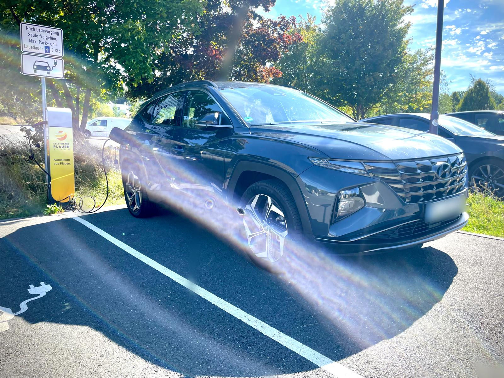
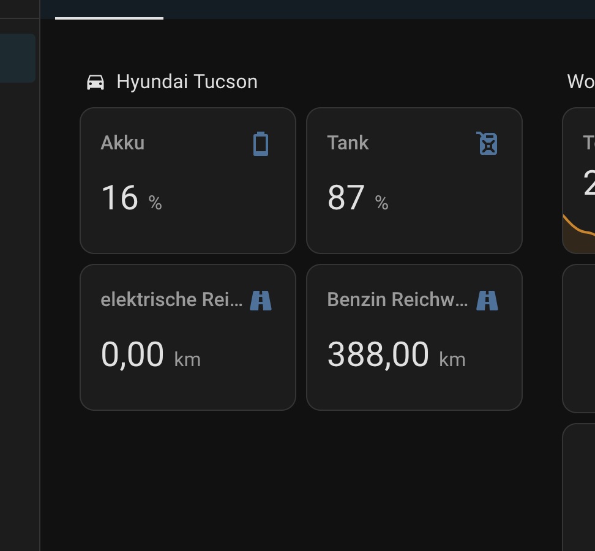

## Meine Erfahrungen mit dem Hyundai Tucson Plug-in Hybrid (PHEV) 2022

Willkommen in meinem kleinen Erfahrungsprojekt rund um meinen **Hyundai Tucson Plug-in Hybrid**  
(Modelljahr 2022, Erstzulassung 05/2022, aktuell ~35.000 km – Stand: Oktober 2025).

Ich möchte hier meine **Erfahrungen, Verbräuche, Eindrücke und Tipps** zum Auto teilen.  
Ziel ist es, realistische Einblicke in Alltag, Kosten und Nutzung eines PHEV zu geben – ohne Marketing, einfach aus Fahrersicht.

  
   
  <em>Mein Hyundai Tucson Plug-in Hybrid beim Laden (Oktober 2025)</em>

---

## Hintergrund

Vor dem Tucson fuhr ich einen **Ford Focus Turnier (2019)**  
mit dem **1.0-Liter Turbo-Benziner (85 PS)**.  
Der Wechsel erfolgte, um ein moderneres Fahrzeug mit besserer Ausstattung und teilweiser Elektrifizierung zu haben.

---

## ⚡ Lade- und Verbrauchserfahrungen der letzten 2500km

- **Laden auf der Arbeit:**  
  - Ich kann dort sehr günstig laden – etwa **10 Cent/kWh** 
  - dort ist das tägliche Laden finanziell sehr attraktiv

- **Alltagsnutzung (ca. 1500 km innerorts + Landstraße):**  
  - Fahrprofil: 2× pro Woche 25 km hin und zurück über Landstraße  
  - Regelmäßiges Laden (2× pro Woche, gelegentlich zusätzlich)  
  - **Durchschnittsverbrauch:** ca. **5,6 Liter / 100 km**

- **Langstrecke (zusätzlich ~1000 km Autobahn mit 150–200 km/h):**  
  - Verbrauch stieg auf **6,7 Liter / 100 km**

---

## 🏙️ Infrastruktur & Laden allgemein

Ich lebe zur Miete, **Zuhause laden ist leider nicht möglich**.  
Die öffentliche Ladeinfrastruktur in meiner Stadt ist **okay, aber nicht überragend**.

- **EnBW Mobility+** kostet aktuell rund **0,70 €/kWh**, was das öffentliche Laden teuer macht.  
- **Günstige Ladepunkte** zu finden, ist mühsam – besonders, wenn man keine feste Wallbox nutzen kann.  

Aktuell lohnt sich das Laden **nur auf der Arbeit** wirklich.

---

## 🏡 Integration in Home Assistant

Ich nutze **Home Assistant**, um mein Auto besser ins Smart Home einzubinden.  
Dazu verwende ich die **Kia Uvo / Hyundai Bluelink Integration** aus HACS.

Während der **5 Jahre Neuwagengarantie** habe ich **Bluelink Plus** kostenlos verfügbar.  
Über diese Schnittstelle kann ich z. B.:

- den aktuellen **Ladezustand** und **Reichweite** abrufen,  
- einige Befehle **aus der Ferne ausführen**,  
- **Standortdaten** und **Fahrtenhistorie** einsehen.

> 💡 **Hinweis:**  
> Die Authentifizierung über E-Mail & Passwort funktionierte bei mir nicht zuverlässig.  
> Stattdessen habe ich mir einen **API-Token generieren lassen**, um die Verbindung stabil herzustellen.

  
   
  <em>Bluelink Integration zum Abrufen der Reichweite</em>

---

## ✅ Pro & Contra

### **Pro**

**Qualität & Verarbeitung**  
- Gute bis sehr gute Verarbeitung im Innenraum; Materialien fühlen sich wertig an, kein Premium, aber solide.  
- Rückfahrkamera liefert klare Bilder auch bei Dunkelheit.  
- Sitze hinten in der Neigung verstellbar – angenehmes Komfortfeature.  

**Fahrverhalten & Antrieb**  
- Sehr guter Fahrkomfort für ein 1,9‑Tonnen-Fahrzeug.  
- Sanftes Schaltverhalten; Übergänge kaum spürbar.  
- Hohe Systemleistung (265 PS) sorgt für ausreichend Power.  

**Elektrik & Konnektivität**  
- Gute elektrische Reichweite im Alltag: 50–55 km.  
- Bluelink App funktioniert zuverlässig und ist intuitiv.  
- Infotainment reagiert flüssig, stabile Konnektivität, guter Bildschirm.  

**Sonstiges**  
- 5 Jahre Neuwagengarantie.  

---

### **Contra**

**Fahrverhalten & Schaltung**  
- Schaltwippen funktionieren nur eingeschränkt; selbst im Sportmodus springt die Automatik gelegentlich zurück auf D.  

**Qualität & Verarbeitung**  
- Folie am D-Schalter löst sich teilweise und bildet Luftblasen.  
- Türen lassen leichte Außengeräusche durch; Wind, Abrollgeräusche und Regen sind hörbar.  

**Infotainment & Bedienung**  
- Menüführung ist verschachtelt; initial etwas verwirrend.  

**Praktikabilität**  
- Akku reduziert den Kofferraum-Stauraum etwas (unten), oben bleibt ausreichend Platz.

---
